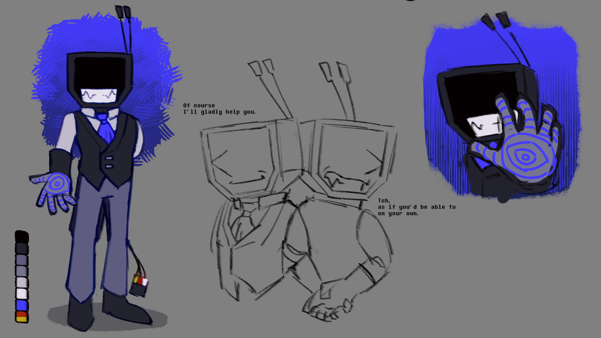
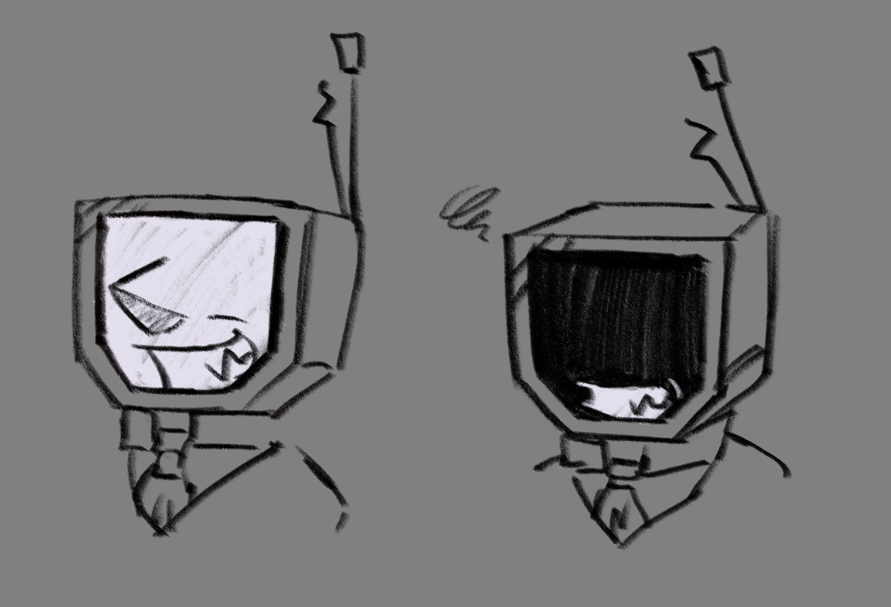


Already deeply hurt by the abandonmnet, the abuse and missuse fully breaks Kayden, remaking himself from the ground up.


I think i don't take enough into account that R. Kayden is actually pretty well taken care of!  It kind of relates to his desire to offer the best of himself all the time. The null! version of him explores to how different he ends up beeing after receiving the completely oposite treatment:

* For starters, there's the physical evidence of damage, keeping his screen on is straining for him hence why he defaults to have it shut off.

* Can't really pick up signals so he is only of use connected to things like consoles: This makes him much less hesitant to adapt to the newer tech, whatever helps him be a little more of use is welcomed.
* He is really rough on himself, doesn't take failure kindly, and he holds those high standards to the rest (even if he doesn't show it at first). I mean. Original Kay also does this but in this case it's more extreme.
* Somehow more on edge than normal Kay ->  sharp teeth are on *always*.
* Doesn't fear the new tech tho, he's got an RCA to HDMI adapter and mocap gloves
* Has polished his game modifying abilities to make them more addictive to players -> possible control thing...?
* Lost his whimsy, games are now just a means to an end 😔
* More of a "serious" butler in a sense, but the kind to poison everyone and get away with it
* Fake ass mf , also a fake it till you make it pro
* Bad tendency to see others as stepping stones.  However he will always try to get to their good side, and gets annoyed when they dislike him. Kind of a "with me or against me" mentality.
* Doesn't deny himself what he wants, at most he just postpones it.
* Much more forward, though less loyal.